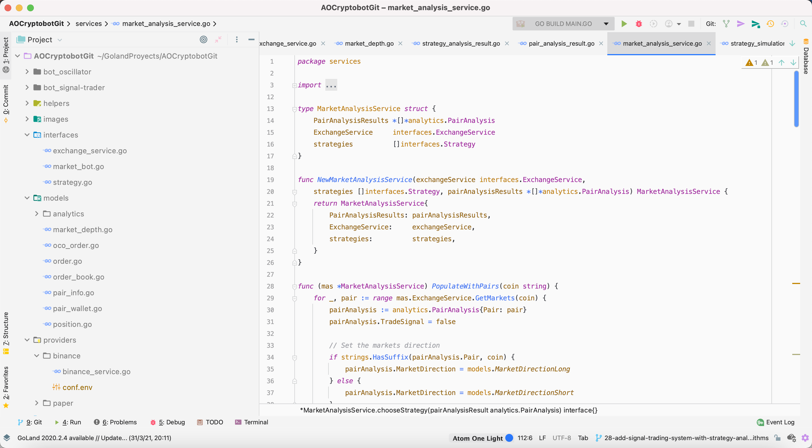
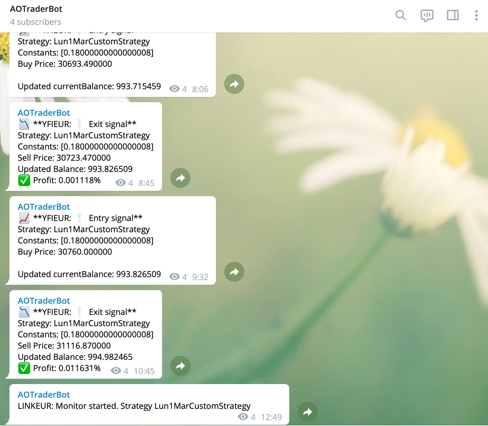

# AOCryptobot

- **Dates:** 2020 → 2023
- **Status:** Archived, open source
- **Stack:** Go, DDD, Binance API
- **Code:** [gitlab.com/aoterocom/AOCryptobot](https://gitlab.com/aoterocom/AOCryptobot)

A trading bot that started in two days during the January 2021 crypto rally, as a market maker that profited from price oscillations, and grew into something much larger.

- Parametrised strategies built on well-known indicators such as RSI, MACD and Stochastic RSI, used as entry and exit signals.
- A backtest analyser that searches, for each strategy and market, the parameters that performed best over the last days.
- Several strategies and markets at once, choosing the strategy with the best ratio of profit to standard deviation.
- Binance and paper trading.

It reached an average weekly profit of about 2.5%.

