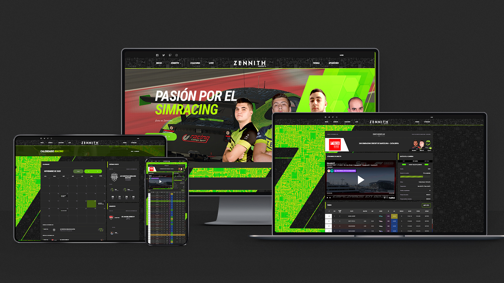
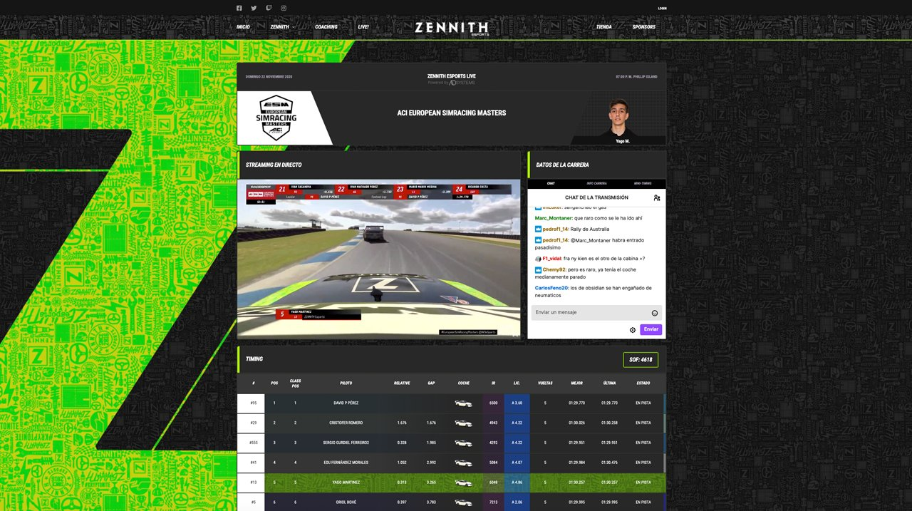

# Zennith Esports

- **Dates:** 2020 → 2022
- **Status:** Privado
- **Stack:** Angular, PHP, Python, MongoDB, Go

Software web y de escritorio para Zennith Esports, un equipo español de sim racing, que une los datos en tiempo real del juego con servicios web.

- Un cliente de escritorio en Python instalado en el ordenador de cada piloto detecta el simulador y envía datos en directo, de modo que la retransmisión del equipo muestra los tiempos en vivo directamente desde los pilotos.
- Los eventos funcionan solos: el sistema se pone en directo con los datos del evento y el stream de Twitch o YouTube.
- Un bot de community manager genera el cartel del evento como imagen y lo publica la mañana del evento y al empezar.
- Los perfiles de los pilotos se sincronizan con las API de los simuladores, y el equipo comparte los setups de los coches automáticamente.
- Frontend en Angular, API en PHP con MongoDB, sincronizada con la autenticación y los calendarios de Nextcloud.

