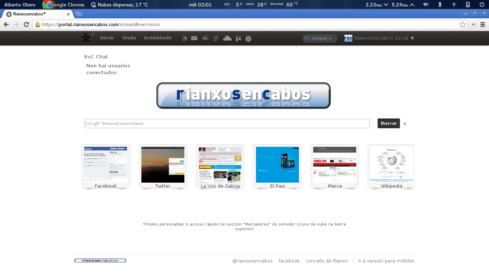
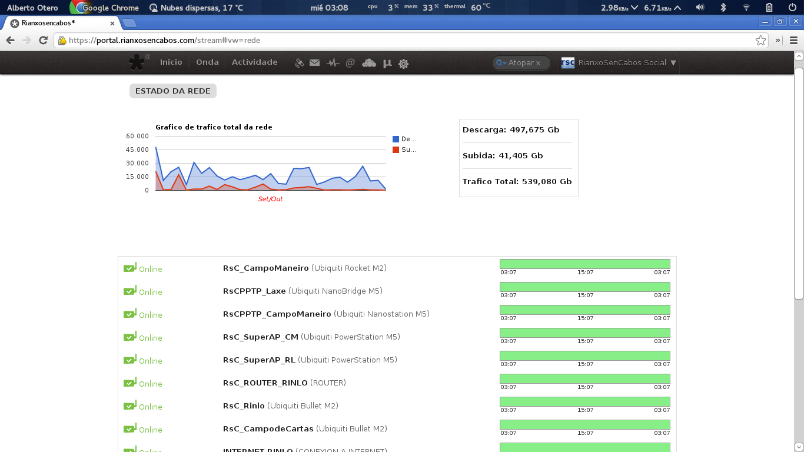

# RianxoSenCabos

- **Dates:** 2006 → 2015
- **Role:** Network and systems lead, volunteer
- **Stack:** OpenWRT, FreeRADIUS, MySQL, PHP, Debian, Postfix, Dovecot

A non-profit wireless networking association that brought internet access to rural areas without public infrastructure. It grew into a metropolitan area network of more than 100 km², giving ISP service to over 50 members with 97% uptime over nine years.

I designed and built most of its software and servers:

- A customised OpenWRT on the access points with a Coova captive portal, backed by FreeRADIUS on MySQL.
- A members portal with a single sign-on across every service, plus automatic PayPal payments.
- An admin panel that scraped the access points every minute (signal, noise, connected devices, bandwidth) and let us manage every member.
- A self-hosted social network (Diaspora), mail server with webmail, 50 GB of cloud storage per member (ownCloud) and a streaming server.
- A Debian server with RAID 10 and three networks, and a backup server at a second site with its own connection.

